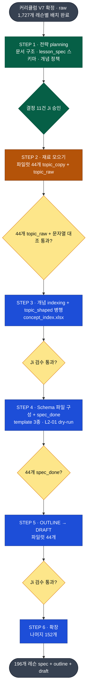

# 코스 제작 계획

> **강의 제작 로드맵과 계획은 이 문서 하나에서만 본다.** 전체 계획, 작업 규칙, 결정 기록, 실시·미실시 사항이 전부 여기 있다.
> **지금 당장 할 일**만 [`to_do.md`](../../01_inbox/conversation_log/to_do.md)에 있다.
> 용어는 [`glossary.md`](glossary.md), 레슨 상세 설계법은 [`lesson_design_method.md`](lesson_design_method.md), 도구는 [`course_tech_stack.md`](course_tech_stack.md)가 단일 출처다.
> 사업 로드맵(Phase 1~5)은 [`_about/Koreanwithji_기획서_v6_260902.md`](../../_about/Koreanwithji_기획서_v6_260902.md) §2.
> 최종 갱신: 2026-09-13 (`brainstorm.md` 내용 흡수, 4층 구조로 개정)

---

## 1. 목적과 성패 기준

제1원칙: **코스가 모든 것의 축이다.** Draft가 완성돼야 영상이 나오고, 거기서 숏폼, 롱폼, eBook, 블로그, 마케팅이 파생된다. Draft가 비면 사업 전체가 빈다.

성패는 하나로 측정한다: **"Ji가 손으로 안 써도 Draft가 안정적으로 쌓이는 시스템이 도는가."**

산출물의 정체는 **사람도 읽고 AI도 읽는 영상 설계서**다.
- AI 입장: VISUAL/VOICEOVER 필드를 그대로 영상·음성 생성 AI 프롬프트로 넣는다
- Ji 입장: 읽고 바로 이해·수정하고, 필요하면 보고 직접 촬영·편집도 한다

---

## 2. 전체 흐름도



> 읽는 법: 초록 = 완료, 주황 = 지금 여기, 파랑 = 예정, 노랑 마름모 = 완료 조건(통과해야 다음).

---

## 3. 실시 사항과 미실시 사항

### 3-1. 실시 사항 (끝난 것)

| 날짜 | 한 것 |
|---|---|
| 2026-09-03 | `01_raw` 대청소(빈 폴더 275개·중복 44개·orphan 2개 삭제). 생산 라인 재설계 착수 |
| 2026-09-04 | **STEP 1 완료.** 결정 11건(§10). 문서 3분할(`course_plan`·`brainstorm`·`glossary`). `02_lesson_spec/` 폴더 신설 |
| 2026-09-07 | raw 848개 파일의 구 번호 `Mapped Ji Lesson` 필드 삭제 (매핑 정본은 index xlsx와 폴더 경로). 발췌 규칙 5번(Transcript 제외) 추가. RAW_DIGEST 존치 확정. 트랙 밖 .md 1개 Ji가 삭제 |
| 2026-09-11 | 관통 테스트 계획 수립(L2-01 은/는 & 이/가, Ji 승인). 실행은 아직. 2026-09-13 순서 개정으로 STEP 4 dry-run이 됨 |
| 2026-09-13 | 문서 구조를 3층에서 **4층**으로 개정(DP-2). `brainstorm.md` 내용을 이 문서로 흡수. **STEP 순서 개정(DP-6)**: 재료 모으기 → 개념 indexing + `topic_shaped` 병행 → Schema 순으로 바꿈 |

### 3-2. 미실시 사항 (남은 것)

STEP 순서대로 적는다. 지금 착수한 것은 [`to_do.md`](../../01_inbox/conversation_log/to_do.md)로 옮겨 관리한다.

**STEP 2 · 재료 모으기: 파일럿 44개 `topic_copy` + `topic_raw`**

| # | 할 일 | 비고 |
|---|---|---|
| 2-1 | `topic_copy` 스크립트: V7 4번 컬럼을 레슨당 spec 1장으로 편다 | 판단 없음, 검수 불필요 (§6-1) |
| 2-2 | 파일명 규칙 적용 (§7) | 44장 생성 확인 |
| 2-3 | `topic_raw` 조준 발췌 | 규칙 5개 준수 (§6-2) |
| 2-4 | Ref_No 매칭: index xlsx를 열어 파일명으로 붙인다 | `01_Ji_draft`는 경로만 (DP-10) |
| 2-5 | 발췌문 문자열 대조 검증 스크립트 | 환각 차단 장치. **STEP 2 게이트** |

**STEP 3 · 개념 indexing + `topic_shaped` 병행**

| # | 할 일 | 비고 |
|---|---|---|
| 3-1 | `concept_index.xlsx` 신설 (§9) | `별칭` 컬럼이 핵심 |
| 3-2 | 레슨마다 매핑된 raw 파일에서 **가르치는 개념을 뽑아 index에 올린다** | 레슨 순서대로. 이미 있는 개념이면 새로 만들지 않고 `별칭`·`등장레슨`에 추가 |
| 3-3 | 개념 polish: 44개를 훑어 표준명 통일, 중복 병합, `최초레슨` 1개로 확정 | 같은 개념이 여러 이름으로 쪼개지는 것을 여기서 막는다 |
| 3-4 | polish된 표준명을 기준으로 `topic_shaped`: V7 복사본과 발췌를 대조해 `TEACHING_POINTS` 순서·범위 확정 | §6-3 |
| 3-5 | Ji 검수 (레벨 단위 4묶음). 개념 index와 TEACHING_POINTS를 같이 본다 | **STEP 3 게이트** |

**STEP 4 · Schema 파일 구성 + `spec_done`**

| # | 할 일 | 완료 조건 |
|---|---|---|
| 4-1 | `lesson_spec_template.md` 작성. frontmatter + 필드 10개 + `RAW_DIGEST` | 필드 누락 0 |
| 4-2 | `outline_template.md` 작성. BEAT/CHECK 단위와 [`lesson_design_method.md`](lesson_design_method.md) 교수 순서 반영 | dry-run으로 검증 |
| 4-3 | `draft_template.md` 작성 + Draft 머리말 필드 이름 확정 (spec 필드와 겹치면 안 된다, §11) | 이름 목록 확정 |
| 4-4 | **dry-run: L2-01.** template에 `spec_done`까지 채우고 OUTLINE을 뽑아 Ji 친작 draft와 대조 | 손실 목록 + 결함 목록 문서화 → template 수정 |
| 4-5 | 44개 `spec_done`: 기존 spec을 template 형식으로 옮기고 필드 10개 채움. `NEW`/`PREREQ`/`THROUGH_LINE`은 표준명만 | **STEP 4 게이트** |

**STEP 5 · OUTLINE → DRAFT (파일럿 44개)**

| # | 할 일 | 비고 |
|---|---|---|
| 5-1 | `01_course_outline_and_draft/` 안에 V7 구조와 같은 레슨 폴더 트리 생성 | 지금 index .md 1장뿐 |
| 5-2 | **DP-12 결정**: Ji와 같이 보며 생성 vs batch | 권장은 초반 같이 → 안정 후 batch |
| 5-3 | 44개 outline 생성 → Ji 검수 | 층 3 |
| 5-4 | BUDGET 기계 검사. 예문이 안 배운 문법을 썼는지 대조 | `concept_index` 완성 후 가능 |
| 5-5 | 44개 draft 생성 → Ji 검수 | 층 4. **STEP 5 게이트** |

**STEP 6 · 확장**

나머지 **152개** 레슨(196 - 44)을 같은 라인에 올린다. VSL 1개와 Intro 2개도 여기 포함된다.

**Draft 안정화 이후로 미룬 것**

| # | 할 일 | 시점 |
|---|---|---|
| L-1 | 영상 PoC. 레슨 1개를 draft에서 실제 영상까지 끝까지 | draft 안정 후 |
| L-2 | **DP-13**: 영상 도구와 Replicate 모델 | PoC 시점 |
| L-3 | **DP-14**: Skool 무료 공개 범위 | 영상 나온 뒤 |
| L-4 | Koreanwithji 유튜브 영상 .md 변환 + `kor_yt_md_pipeline.py` 경로 수정 (실행하면 죽는 상태) | 변환 필요할 때 |

**문서 정비**

| # | 할 일 |
|---|---|
| D-1 | `01_course_outline_and_draft.md`(4줄 메모)를 폴더 index 규격으로 재작성 |
| D-2 | `00_curriculum_and_index/`에 폴더 index .md가 없다 |
| D-3 | 트랙 폴더명 `05_Reddit`과 index 파일명 `05_web_index.xlsx` 불일치 |

---

## 4. 현황 (2026-09-13 실측)

### 가진 것

| 자원 | 수치 | 비고 |
|---|---|---|
| 커리큘럼 맵 V7 | 196개 레슨, 16개 레벨 | [정본 xlsx](00_curriculum_and_index/Korean%20Course%20Curriculum%20Map_Final_V7.xlsx) |
| `01_raw` 전체 .md | 1,746개 | 그중 레슨별 배치분 1,727개 |
| 레슨 폴더 | **196개. V7과 정확히 일치** | 폴더 구조 자체가 "레슨 ↔ raw" 매핑이다 |
| 트랙별 파일 | Ji_draft 97 / yt_md 849 / Amira 438 / HTSK 339 / Reddit 4 | 트랙 폴더 보유 레슨 수는 각각 72 / 185 / 90 / 150 / 4 |
| 트랙별 index xlsx | 5종 | 파일별 메타(채널, HTSK 유닛, Amira Day, Ref_No) |
| Ji 친작 90% Draft | 3개 | `1-01 How Korean works`(352줄), `2-01 은는 & 이가`(372줄), `2-02 Rule of Three`(141줄). **Ji 고유 스타일의 본보기** |
| 파일럿 44개의 `01_Ji_draft` | **39개 레슨**에 있음. 그중 100줄 이상 파일이 있는 레슨 32개 | 없는 5개: `Hangul-6 띄어쓰기/사이시옷`, `Numbers-6 Doing Math`, `L1-18 Plain Form`, `L1-21 Mixing Speech Levels`, `L2-8 Context markers #3` |

### 아직 없는 것

`02_lesson_spec/` 0장 · `01_course_outline_and_draft/` 산출물 0장 · `concept_index.xlsx` 없음 · template 3종 없음 · 영상 PoC 미실시.

### V7 4번 컬럼 "Ji 레슨 주제"의 실제 분량

| 분량 | 전체 196 | 파일럿 44 | 성격 |
|---|---|---|---|
| 빈칸 | 15 | 0 | 전부 Level 12 + 11-22. 레슨 제목 자체가 주제라 따로 안 적었다 |
| 30자 이하 | 59 | 6 | 키워드뿐. 예: 2-10 Only = `만, 밖에, 뿐` |
| 31~120자 | 79 | 21 | 한 줄 요약에서 항목 2~3개 |
| 121자 이상 | 43 | 17 | teaching point 목록에 가깝다 |

**그래서 spec 작업이 두 갈래다.**

| 갈래 | 레슨 | 무엇이 기준인가 |
|---|---|---|
| 두꺼운 쪽 (121자 이상) | V7에 teaching point가 이미 있다 | **Ji가 쓴 것이 기준.** 발췌는 보강 재료 |
| 얇은 쪽 (30자 이하 + 빈칸) | V7에 키워드뿐이거나 비어 있다 | **발췌가 기준.** 여기서 사실상 새로 쓴다 |

얇은 쪽이 곧 어려운 쪽은 아니다. Level 12는 raw도 레슨당 1개 4~7KB라 양쪽 다 얇아 빨리 끝난다. 파일럿에서 가장 어려운 경로는 **Ji_draft가 없는 5개**다.

---

## 5. 문서 구조: 4층 (DP-2, 2026-09-13 개정)

```
[층 1] raw           02_product/01_raw/01_by_level_lesson/            읽기 전용, 링크 없음, 1,727개
[층 2] lesson_spec   02_course_creation/02_lesson_spec/               레슨당 1장, 196장
                     "이 레슨이 무엇을 가르치는가"의 단일 출처
[층 3] outline       02_course_creation/01_course_outline_and_draft/  spec에서 파생, 레슨당 1장
                     "어떤 순서와 뼈대로 가르치는가"
[층 4] draft         02_course_creation/01_course_outline_and_draft/  outline에서 파생, 레슨당 1장
                     BEAT 단위 영상 설계서
```

**층 3과 층 4는 폴더를 나누지 않는다.** 한 레슨 폴더 안에 `_outline.md`와 `_draft.md`를 나란히 둔다. 같은 레슨의 두 층을 한 곳에서 대조하기 위해서다.

**왜 outline과 draft를 층으로 나누는가.** 둘은 검수하는 질문이 다르다. outline은 "순서와 범위가 맞는가", draft는 "BEAT와 톤이 맞는가"다. 한 층으로 묶으면 outline이 틀린 채로 draft 살까지 붙은 뒤에 발견되고, 그러면 draft를 통째로 다시 쓴다. 층을 나누면 outline에서 먼저 막는다.

> **링크는 위에서 아래로만 흐른다. raw는 아무것도 링크하지 않고, 아무것도 raw를 링크하지 않는다.**

**spec이 raw를 가리킬 때는 링크가 아니라 경로로 적는다.**

```
[X] SOURCES: [[02-02 TSV Sentence Structure #1...]]     ← 그래프에 엣지 생김
[O] SOURCES: 01_Ji_draft/02-02 TSV Sentence Structure #1 - The rule of three_lesson script.md
```

에이전트는 경로만 있으면 파일을 읽는다. Obsidian 그래프는 `[[ ]]`만 엣지로 세니, 경로로 적으면 에이전트는 다 읽는데 그래프는 깨끗하다.

결과: 노드 spec 196 + outline 196 + draft 196 + concept 0. 털뭉치가 아니라 거의 나무가 된다.

이 규칙은 새 부담이 아니다. [`CLAUDE.md`](../../CLAUDE.md) §2-3 "01_raw는 읽기 전용"이 이미 강제하고 있다.

---

## 6. lesson_spec 작업 4단계 (DP-7, DP-8, DP-6 개정)

spec 1장이 4단계를 거치며 자란다. **별도 중간 파일을 만들지 않는다.** 각 단계가 frontmatter의 `status` 값과 1:1로 대응한다.

```
topic_copy → topic_raw → topic_shaped → spec_done
 └── STEP 2 ──┘    └─ STEP 3 ─┘    └ STEP 4 ┘
                   (+ 개념 indexing 병행)
```

**개념 indexing은 spec을 쓰는 동안 같이 한다 (2026-09-13 개정).** spec을 다 쓴 뒤에 개념을 따로 정리하면 레슨마다 제각각 붙은 이름을 사후에 맞추느라 spec을 다시 고친다. `topic_shaped`와 병행하면 TEACHING_POINTS를 확정하는 순간 이미 통일된 표준명을 쓴다.

**template은 STEP 4에서 만든다.** 그 전까지 spec은 최소 뼈대로 둔다: frontmatter(`lesson_id`/`level`/`lesson_no`/`title`/`status`) + `## TOPIC`(V7 복사) + `## TEACHING_POINTS` + `## RAW_DIGEST`. 나머지 필드는 `spec_done`에서 template 형식으로 옮기며 채운다.

### 6-1. V7 복사 (`topic_copy`)

V7 4번 컬럼을 레슨당 spec 1장으로 편다. **스크립트 일괄. 판단이 안 들어가므로 검수 불필요.**

- 슬래시로 뭉친 것을 불릿으로 편다
- 빈칸 레슨은 "raw에서 채워야 함"으로 표시한다. **빈 파일로 두지 않는다**

**이 단계를 왜 먼저 하는가.** 여기서 나오는 게 조준점이다. "2-10은 만/밖에/뿐만 본다"는 한 줄이 있어야 다음 단계에서 raw를 골라 읽을 수 있다. 이건 raw 없이 만들 수 있어서 비용이 0이다.

### 6-2. 조준 발췌 (`topic_raw`)

조준점을 들고 레슨 폴더의 raw를 읽어 **해당 주제 대목만** 뽑아 spec의 `RAW_DIGEST` 섹션에 넣는다.

**raw를 한 장으로 합치지 않는 이유.** 폴더가 이미 취합본이다. 다중 매핑 자료는 레슨 폴더마다 사본이 따로 있다(Miss Vicky `6 Essential Particles`는 7개 폴더에 7개 사본). 합치면 Level 2-02가 588KB 한 장이 되는데, 한국어 md 588KB는 대략 20만 토큰이라 에이전트가 한 번에 못 읽는다. **합치면 지금보다 나빠진다.**

**Ji가 정확도를 최우선으로 지정했다. 규칙 5개다.**

| 규칙 | 이유 |
|---|---|
| 원문 그대로 인용. 요약 금지 | 요약하면 뉘앙스가 날아간다. 예문은 특히 그렇다 |
| 출처 3종 표기: Ref_No + 파일명 + 섹션 제목 | 어느 자료 어디서 왔는지 되짚을 수 있어야 한다 |
| 발췌문이 원문에 실제로 있는지 문자열 대조 | 에이전트가 지어내는 것을 사람 눈이 아니라 기계로 막는다 |
| 버릴지 애매하면 남긴다 | 원본은 폴더에 그대로 있다. 발췌는 버리는 게 아니라 골라내는 작업이다 |
| `02_yt_md`의 `## Transcript` 섹션(영상 원문 대사)은 가져오지 않는다 | 원본에 이미 있어 필요하면 SOURCES 경로로 되짚을 수 있다. `## Teaching Points`가 이미 구조화된 핵심이다 |

**Ref_No 사용법**

- Ref_No가 무엇인지는 [`glossary.md`](glossary.md) §3. 실무상 중요한 건 **레슨마다 번호가 다르다**는 점이다. 같은 Miss Vicky 영상이 `YT-2-10-3`, `YT-3-11-9`, `YT-4-14-8`로 각각 잡힌다. 다중 매핑 혼선 방지에 정확히 맞는 도구다
- **raw .md 안에는 Ref_No가 적혀 있지 않다.** 에이전트가 index xlsx를 열어 파일명으로 매칭해야 한다
- **`01_Ji_draft` 트랙은 Ref_No를 쓰지 않는다 (DP-10).** Ji가 직접 쓴 자료라 레슨당 1개씩이고 다중 매핑이 아니다. 경로로만 표기한다. 나중에 필요해지면 `Ji-01-01` 형식으로 넘버링할 수 있다

### 6-3. 개념 indexing + 대조와 확정 (`topic_shaped`)

두 작업을 한 흐름으로 돈다.

1. **개념 indexing.** 레슨마다 매핑된 raw 파일에서 가르치는 개념을 뽑아 `concept_index.xlsx`에 올린다. 이미 있는 개념이면 새 행을 만들지 않고 `별칭`과 `등장레슨`에 더한다. 컬럼은 §9
2. **개념 polish.** 44개 전체를 훑어 표준명을 통일하고 중복을 합치고 `최초레슨`을 1개로 확정한다
3. **`topic_shaped`.** polish된 표준명으로 V7 복사본과 발췌를 대조해 `TEACHING_POINTS`의 **순서와 범위**를 확정한다

**여기가 Ji의 검수 지점이다.** 개념 index와 TEACHING_POINTS를 같이 본다. 두 갈래(§4)에 따라 무엇을 기준으로 삼을지 달라진다.

### 6-4. 필드 채우기 (`spec_done`)

STEP 4에서 만든 `lesson_spec_template.md` 형식으로 spec을 옮기고 나머지 필드를 채운다. `NEW`/`PREREQ`/`THROUGH_LINE`은 STEP 3에서 확정한 표준명만 쓴다.

`RAW_DIGEST`는 `spec_done` 이후에도 **남긴다** (2026-09-07 확정). 조준 발췌는 판단이 들어간 작업이라 지우면 재현이 안 된다. spec이 너무 길어지면 그때 뗀다.

---

## 7. 파일명 규칙 (DP-9)

`레벨-레슨_lesson_spec_레슨제목.md` 형태. 예: `02-02_lesson_spec_The Rule of Three.md`

| 항목 | 규칙 |
|---|---|
| 비숫자 레벨 4개 | 레벨명을 그대로 쓴다. `Hangul-01_...`, `Numbers-01_...`, `Intro-01_...`, `VSL-01_...` |
| 자릿수 | 두 자리로 통일. `02-02`, `10-01`. Level 10~12가 있어 정렬이 깨지는 걸 막는다 |
| 금지 문자 | 폴더가 이미 쓰는 치환 규칙을 따른다. `과/와` → `과_와`. Windows에서 `/ \ : * ? " < >` 와 세로줄을 못 쓴다 |

outline과 draft의 파일명은 아직 미정이다 (§11).

---

## 8. lesson_spec 뼈대와 작성 규칙 (DP-3)

필드 10개로 시작한다. **작업하다 필요하면 고친다.** 필드의 뜻은 [`glossary.md`](glossary.md) §2.

```
GOAL · SKELETON · TEACHING_POINTS · NEW · PREREQ · BUDGET
THROUGH_LINE · OUT_OF_SCOPE · SOURCES · OPEN
```

| 필드 | 작성 규칙 |
|---|---|
| `GOAL` | 한 문장. "~를 안다"가 아니라 "~를 할 수 있다"로 쓴다. 이게 없으면 Draft가 어디서 끝날지 모른다 |
| `SKELETON` | 한 줄. [`lesson_design_method.md`](lesson_design_method.md) §1의 뼈대 |
| `TEACHING_POINTS` | 번호 매긴 목록. **순서가 곧 강의 순서다** |
| `NEW` / `PREREQ` / `THROUGH_LINE` | `concept_index.xlsx`의 **표준명만** 쓴다. 임의로 새 이름을 만들지 않는다 |
| `PREREQ` | 레슨 번호를 함께 적는다 (`L1-07 SOV`). 어느 레슨을 딛는지 추적 가능해야 한다 |
| `BUDGET` | 직접 쓰지 않는다. 앞 레슨들의 `NEW` 합산으로 계산한다 |
| `OUT_OF_SCOPE` | 안 다루는 것 + **어느 레슨으로 미루는지**까지 적는다. 레슨 번호가 없으면 그냥 누락이다 |
| `SOURCES` | 우선순위 순. `01_Ji_draft`가 톤 기준, 나머지는 내용 재료 |
| `OPEN` | 막혔을 때 멈추지 말고 여기 적고 넘어간다 |

### BUDGET이 이 스키마의 핵심이다

[`_about/01_brand.md`](../../_about/01_brand.md) §10에 이미 규칙이 있다. **"한국어 예문은 이전 레슨까지 다룬 문법만 사용해 작성한다."** 문제는 지금 이걸 사람 눈으로만 확인할 수 있다는 것이다. 196개 Draft를 Ji가 매번 대조할 수는 없다.

레슨마다 `NEW`를 적어두면 BUDGET은 **앞 레슨들의 NEW 합산으로 자동으로 나온다.** 그러면 Draft 예문이 아직 안 배운 문법을 썼는지 **기계로 검사**할 수 있다.

> **비유**: 요리사에게 "지금까지 산 재료로만 만들어라"라고 말하는 것과, 냉장고 재료 목록을 손에 쥐여주는 것의 차이다. 목록이 있으면 없는 재료를 쓴 순간 걸린다.

### 실물 예시 (Level 2-02)

```yaml
---
lesson_id: L2-02
level: 2
lesson_no: 2
title: TSV Sentence Structure #1 - The Rule of Three
status: spec_done
---

## GOAL
"저는 피자가 좋아요"와 "지수는 피자를 좋아해요"를 언제 어느 쪽으로 쓰는지
스스로 판단해서 말할 수 있다.

## SKELETON
한국어는 남의 마음속을 직접 서술하지 못한다. 그래서 문장 구조가 갈라진다.

## TEACHING_POINTS
1. TSV 구조 복습 (이 사람은 제 친구가 아니에요)
2. 이/가 좋다 - 서술 대상이 "피자"인 이유
3. The Rule of Three - 1인칭만 감정 직접 서술 가능
4. 이/가 좋다 vs 을/를 좋아하다 - 언제 갈라지는가
5. 아/어하다 compound verb 도출
6. 아요/어요 평서문도 Rule of Three 적용 대상

## NEW
- Rule of Three
- 이/가 + descriptive verb (좋다)
- 아/어하다 compound verb

## PREREQ
- L2-01 은/는 vs 이/가
- L1-07 SOV, 목적어 을/를, "descriptive verb는 목적어를 못 가진다"
- L1-05 아/어 활용
- L1-11 아니다

## BUDGET
L1-01 ~ L2-01의 NEW 누적 (자동 계산)

## THROUGH_LINE
Rule of Three (코스 전체 관통), TSV (Level 2 관통)

## OUT_OF_SCOPE
- 다른 compound verb 전반 → Level 3 (prerequisite 미충족)
- 번역 안 되는 감정 어휘 (밉다, 억울하다) → L2-03

## SOURCES (우선순위 순)
1. 01_Ji_draft/02-02 TSV Sentence Structure #1 - The rule of three_lesson script.md   [톤 기준, 90% 완성]
2. 02_yt_md/Go Billy_FAQ_좋다 vs 좋아하다.md
3. 02_yt_md/Miss Vicky_영상 전체_좋아요 vs 좋아해요  What's the Difference.md
   (나머지 23개는 참고. 전체 목록은 폴더 참조)

## RAW_DIGEST
(§6-2의 발췌. 출처 3종 표기)

## OPEN
- 6번 항목(아요/어요 평서문)을 이 레슨에 넣을지 L2-08 Context markers로 미룰지
```

---

## 9. 개념 정책: 페이지 안 만든다 (DP-4)

개념은 spec의 `NEW`/`PREREQ`/`THROUGH_LINE`에 **이름으로만** 존재하고, 목록은 `concept_index.xlsx`가 갖는다. **별도 .md 페이지는 만들지 않는다.**

1. 브랜드 관통 개념(Language Core, Translation Trap, Rule of Three, TSV, STLOHV)은 이미 [`_about/01_brand.md`](../../_about/01_brand.md)에 정의돼 있다. 페이지가 필요한 자리는 이미 차 있고, 남는 건 문법 항목인데 그 설명은 레슨 자체다.
2. 레슨당 NEW 2~4개면 400~800장이다. spec 196장보다 많고 이전 vault의 실패와 같은 규모다.
3. 되돌릴 수 있는 방향이다. 안 만들고 시작해도 나중에 만들 수 있지만 반대는 안 된다.

### concept_index.xlsx 컬럼

| 컬럼 | 용도 |
|---|---|
| `concept_id` | 통일 ID. 이름이 바뀌어도 이건 안 바뀐다 |
| `표준명` | 유일한 정식 이름. spec에는 이것만 쓴다 |
| `별칭` | 소스마다 다르게 부르는 이름들 (예: 은/는 = topic marker = 주제격 조사) |
| `최초레슨` | 이 개념을 `NEW`로 가르치는 레슨. 반드시 1개 |
| `등장레슨` | `NEW`/`PREREQ`에 나오는 레슨 목록 |
| `등장레슨수` | 나중에 개념 페이지가 필요해지면 필터 기준이 된다 |
| `종류` | through_line / 문법 / 어휘 |

**`별칭` 컬럼이 핵심이다.** 196개를 순서대로 작업하면 같은 개념에 다른 이름이 붙는다. 별칭을 한 곳에 모아야 중복이 안 생긴다. 이전 vault에서 개념이 잘게 쪼개진 원인이 정확히 이것이다.

---

## 10. STEP 정의와 결정 기록

### 10-1. STEP 정의와 완료 조건 (DP-6)

> 원칙: 앞 STEP의 **완료 조건**을 못 채우면 다음으로 안 넘어간다 (Linear Scaffolding).

| STEP | 목적 | 산출물 | 완료 조건 |
|---|---|---|---|
| **1 · 전략 planning** <br>**완료 (2026-09-04)** | 무엇을 만들지 정하기 전에 문서 구조와 스키마를 먼저 정한다 | 결정 11건 (§10-2) | Ji 승인 완료 |
| **2 · 재료 모으기** | 파일럿 44개의 조준점과 발췌를 먼저 확보한다 | `02_lesson_spec/` 44장 (`topic_raw`) | 44개 전부 `topic_raw` + 문자열 대조 불일치 0 |
| **3 · 개념 indexing + `topic_shaped`** | 레슨별 raw에서 개념을 뽑아 통일하면서, 그 표준명으로 TEACHING_POINTS를 확정한다 | `concept_index.xlsx` + spec 44장 (`topic_shaped`) | 개념 polish 완료 + Ji 검수 통과 |
| **4 · Schema 파일 구성 + `spec_done`** | 확정된 내용 위에 template을 만들고 spec을 완성한다 | `lesson_spec_template.md`, `outline_template.md`, `draft_template.md` + spec 44장 (`spec_done`) | L2-01 dry-run 결함 반영 + 44개 전부 `spec_done` |
| **5 · OUTLINE → DRAFT** | spec에서 outline(층 3)을 뽑고, 검수 후 draft(층 4)로 살을 붙인다 | 레슨당 outline 1장 + draft 1장 | outline, draft 각각 Ji 검수 통과 |
| **6 · 확장** | 나머지 152개 레슨을 같은 라인에 올린다 | 196개 완주 | - |

**왜 template보다 재료와 개념을 먼저 하는가 (2026-09-13 개정).** template을 먼저 만들면 실제 44개 레슨을 보기 전에 필드를 추측해서 짜게 된다. 재료와 개념을 먼저 모으면 template은 **이미 확인된 내용을 담는 틀**이 되어 빠진 필드가 적다. 개념을 spec과 같이 정리해야 하는 이유는 §6 참조.

**왜 파일럿이 44개(Hangul 6 + Numbers 7 + Level 1 21 + Level 2 10)인가 (DP-5).**
Level 2에 Ji 친작 90% Draft 2개가 있다. 에이전트 산출물을 Ji가 직접 쓴 것과 대조할 수 있는 **정답지가 있는 구간**이다. Level 1의 NEW가 먼저 있어야 Level 2의 BUDGET이 채워지고, Hangul과 Numbers는 그보다 앞선다.

**왜 STEP 4 dry-run이 L2-01인가 (2026-09-11 Ji 선택).** 정답지(Ji 친작 draft 372줄)와 대조해야 template의 결함과 **"Ji가 쓴 것이 outline까지 오는 동안 얼마나 새는가"** 가 보인다. 2-01은 2-02보다 앞 레슨이라 PREREQ 사슬이 Level 1로만 뻗어 단순하다. 발췌만으로 레슨을 만드는 경로(Ji_draft 없는 5개)는 STEP 2에서 44개 전부를 발췌하며 함께 시험된다.

### 10-2. 결정 기록

> 번호를 2026-09-04에 한 체계로 다시 매겼다.

| 번호 | 결정한 것 | 결과 | 날짜 |
|---|---|---|---|
| DP-1 | Obsidian ↔ Claude 연결 방식 | Obsidian MCP + Skill. 근거 [`course_tech_stack.md`](course_tech_stack.md) §1 | 완료 |
| DP-2 | 문서 구조 | **4층(raw / spec / outline / draft) + 단방향 링크** (§5). outline과 draft는 한 폴더 | 2026-09-04 3층 → **2026-09-13 4층 개정** |
| DP-3 | lesson_spec 필드 | **10개로 시작. 작업 중 수정 가능** (§8) | 2026-09-04 |
| DP-4 | 개념 페이지 | **안 만든다. `concept_index.xlsx`로 대체** (§9) | 2026-09-04 |
| DP-5 | 파일럿 범위 | **Hangul + Numbers + Level 1 + Level 2 = 44개** (§10-1) | 2026-09-04 |
| DP-6 | STEP 번호와 게이트 | **STEP 1~6.** 재료 모으기 → 개념 indexing + `topic_shaped` 병행 → Schema + `spec_done` → OUTLINE/DRAFT → 확장 (§10-1) | 2026-09-04 STEP 1~5 → **2026-09-13 순서 개정** |
| DP-7 | raw 취합 방식 | **전량 취합 안 한다. 조준 발췌. 정확도 최우선** (§6-2) | 2026-09-04 |
| DP-8 | 중간 산출물 파일 | **안 만든다. spec 1장의 status 4단계로 관리** (§6) | 2026-09-04 |
| DP-9 | 파일명 규칙 | **확정** (§7) | 2026-09-04 |
| DP-10 | Ji_draft 트랙의 Ref_No | **쓰지 않는다. 경로로만 표기** (§6-2) | 2026-09-04 |
| DP-11 | spec 저장 위치 | **`02_course_creation/02_lesson_spec/` 신설** | 2026-09-04 |

---

## 11. 아직 안 정한 것

| 번호 | 정할 것 | 시점 | 권장 / 근거 |
|---|---|---|---|
| DP-12 | 생성 방식: Ji와 같이 보며 vs batch | STEP 5 진입 전 | 권장: 초반 같이 보며 → 안정 후 batch |
| DP-13 | 영상 도구 (Remotion vs HyperFrames) + Replicate 모델 | DRAFT 이후 | [`course_tech_stack.md`](course_tech_stack.md) §5 |
| DP-14 | Skool 무료 공개 범위 | 영상 나온 뒤 | [`_about/Koreanwithji_기획서_v6_260902.md`](../../_about/Koreanwithji_기획서_v6_260902.md) §6 |
| - | template 저장 위치 | STEP 4 착수 시 | 권장(2026-09-11): `02_course_creation/_templates/` 신설. spec 폴더에 섞으면 스크립트가 template까지 센다 |
| - | outline / draft 파일명 | STEP 4 dry-run 시 | 권장(2026-09-11): DP-9와 같은 꼴 `02-01_lesson_outline_레슨제목.md`. 현 폴더 메모의 `레벨-레슨-레슨명_outline.md`는 spec 규칙과 어긋난다 |
| - | Draft 머리말 필드 이름 | draft_template 작성 시 | spec 필드와 이름이 겹치면 안 된다. **개념 이름의 원본은 spec 하나다** |

---

## 12. 리스크

| 위험 | 영향 | 막는 법 |
|---|---|---|
| **vault 전체가 git에 안 올라가 있다** | spec·outline·draft를 쌓다 실수로 지우면 되돌릴 방법이 없다 | STEP 2에서 spec 44장을 만들기 전에 한 번 정리하고 커밋. 판단은 Ji |
| raw에 링크 삽입 재발 | 엣지 폭발, 그래프 무용화 | `01_raw`는 읽기 전용. spec은 raw를 **경로**로 가리킨다 (§5) |
| 게이트가 너무 뒤에 있음 | Draft 한 장 못 보고 몇 주 소모. template 없이 모은 재료가 형식이 제각각이라 STEP 4에서 다시 손봄 | STEP 2~3은 최소 뼈대(§6)로 통일하고, STEP 4에서 L2-01을 OUTLINE까지 먼저 관통시켜 결함을 잡은 뒤 44개에 적용 |
| 개념 정리 시 AI 환각 | 잘못된 개념, 없는 예문 | 닫힌 소스 + 원문 인용 강제 + 문자열 대조 + Ji 게이트 |
| 개념 이름이 레슨마다 달라짐 | 같은 개념이 여러 이름으로 쪼개짐 (이전 vault의 실패 원인) | `concept_index.xlsx`의 `별칭` 컬럼으로 통일 |
| 옛 concept 링크를 근거로 씀 | 틀린 개념 연결이 새 문서로 전파 | `concept_` 흔적은 오염 자료로 취급하고 참고조차 하지 않는다 |
| 커리큘럼이 생산 중 흔들림 | Draft 순서·내용 붕괴 | V7 고정. 변경은 정식 절차로만 |
| Ji 색깔(톤) 흔들림 | 브랜드 소멸 | [`_about/01_brand.md`](../../_about/01_brand.md) §8 + Ji 친작 Draft 3개를 본보기로 고정. 관통 테스트에서 정답지 대조로 측정 |
| Ji 검수 병목 | 라인 정체 | 층마다 검수(spec → outline → draft), 레벨 단위 묶음 검수 |

---

## 13. 최종 목표 상태와 병행 작업 줄기

**목표 상태**

1. Vault가 돌아가고 CLAUDE.md가 AI를 규율 있는 사서로 유지한다
2. 레슨 196개마다 spec + outline + draft가 한 세트로 쌓인다
3. 문서 연결이 위에서 아래로만 흘러 에이전트가 레슨 하나를 쓸 때 읽을 파일을 즉시 찾는다
4. 강의 1개를 Draft에서 실제 영상까지 끝까지 만드는 PoC 성공
5. 나머지 레슨은 같은 라인에 올리기만 하면 되는 상태

**병행 작업 줄기 (LOE)**

```
줄기 1  커리큘럼   : V7로 확정 완료 → 변동 시 그때 수정
줄기 2  Schema    : STEP 1 결정 완료 → STEP 4에서 template 제작 → 각 STEP 진입 전 정비
줄기 3  레슨 내용  : STEP 2부터 spec(+ concept_index) → outline → draft 누적 → 운영 내내 성장
줄기 4  도구/AI    : STEP 2에서 발췌·대조 스크립트 → STEP 4 이후 운용·개선
줄기 5  영상 생산  : Draft 안정화 이후 별도 확장 (영상 제작 PoC)
```
