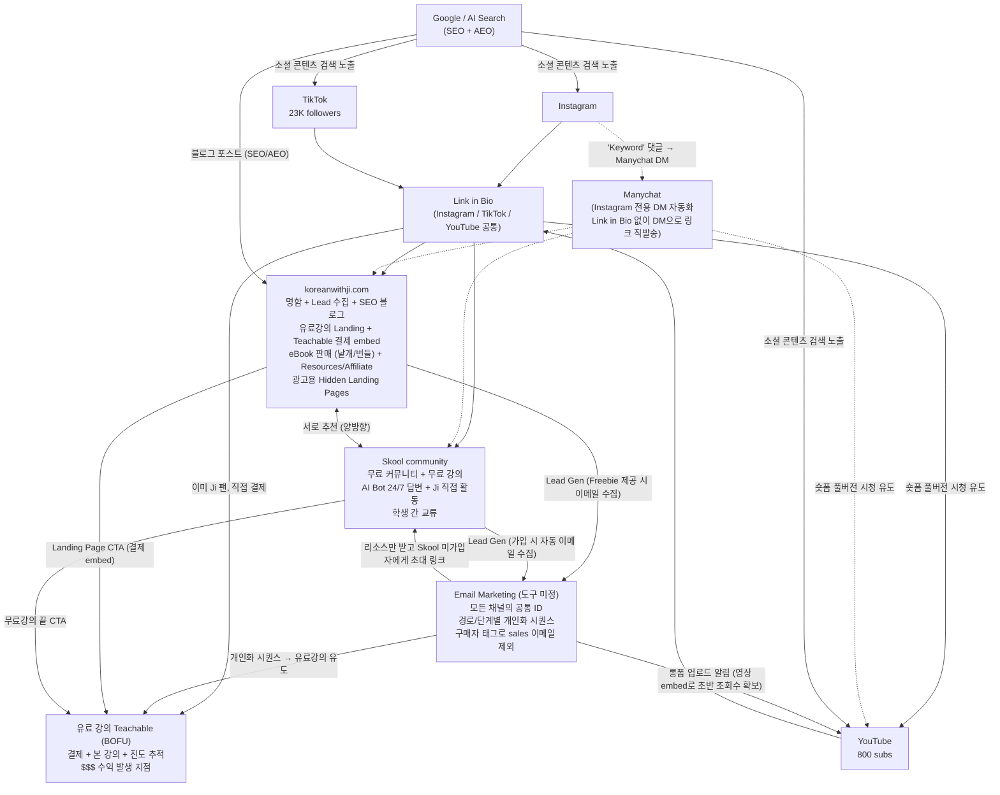

## 1. Funnel 구조 (핵심)

### 1-1. 전체 그림 (Mermaid flowchart)


### 1-2. 트래픽 진입점 (4가지 출처)

| 출처 | 진입 방식 | 도착지 | 비고 |
|---|---|---|---|
| **TikTok** (23K) | Link in Bio (3갈래: Web/Skool/Teach) | Web, Skool, Teach | 가장 큰 청중 |
| **Instagram** (100) | Link in Bio + **Manychat 자동응답** — 특정 키워드 댓글 시 DM으로 링크 발송 | Web (resource), Skool (community) | 댓글 → DM 자동화로 알고리즘 점수 ↑ |
| **YouTube** (800) | Link in Bio + Description 링크 + Email 알림 시 영상 embed로 초반 조회수 확보 | Web, Skool | 롱폼 업로드와 이메일 알림이 한 세트 |
| **Google / AI Search** | 블로그 포스트 검색 결과 | Web | **SEO + AEO** (AI Search Optimization) 둘 다 필요 |

### 1-3. 유료강의 진입 경로 (전환 경로 전체)
1. **TikTok → Teachable 직접** (이미 Ji 팬)
2. **TikTok → koreanwithji.com → Teachable** (랜딩 페이지 임베딩 결제)
3. **TikTok → koreanwithji.com → Email → Teachable** (Freebie 수집 → 시퀀스)
4. **TikTok → Skool → Email → Teachable** (Skool 가입 → 시퀀스)
5. **TikTok → Skool → Teachable** (무료강의 종료 후 CTA)
6. **Instagram → Manychat DM → koreanwithji.com / Skool → ...** (위 경로 합류)
7. **YouTube → koreanwithji.com / Skool → ...** (위 경로 합류)
8. **Search → koreanwithji.com → ...** (SEO/AEO 진입 후 위 경로 합류)
9. **Email → YouTube → koreanwithji.com / Skool → ...** (양방향 순환)

### 1-4. 채널별 정체성과 역할

원칙: **한 채널이 여러 역할을 가져도 됨. 단, 그 채널의 역할이 사용자 입장에서 명확해야 함.**

| 채널 | 정체성 | 주요 역할 (복수 가능) | 대상 |
|---|---|---|---|
| **koreanwithji.com** | Ji의 공식 사이트 + Resource 창고 + 유료강의 랜딩 | (1) 명함 + Lead 수집 + SEO/AEO 블로그<br>(2) 유료강의 Landing Page (VSL 포함, Teachable 결제 embed)<br>(3) eBook 판매 (Teachable Digital Downloads embed)<br>(4) Resources + Affiliate 링크<br>(5) 광고 캠페인별 Hidden Landing Pages | 처음 만난 사람 + 결제 직전 사람 |
| **Skool community** | 신뢰 형성장 + 무료 학습 체험관 | 무료 강의 + 커뮤니티 + AI Bot 24/7 + Ji 직접 활동 | 알게 된 사람 |
| **Teachable** | 결제대 + 본 강의 시청관 | 유료 강의 + 결제 처리 + 진도 추적 + Digital Downloads (eBook) | 신뢰한 사람 |

### 1-5. koreanwithji.com 상세 역할 (확장 명세)

#### (1) 유료강의 Landing Page + 결제 임베딩
- VSL("Korean Language Core") 영상 메인 노출
- **Teachable 결제 위젯을 koreanwithji.com 내부에 embedding** → 외부 이동 클릭 1회 제거 → **전환율 ↑**
- 실제 결제 처리는 Teachable 백엔드에서 진행 (UI만 자사 도메인)

#### (2) 광고용 Hidden Landing Pages
- 추후 사업 scale up 시 Paid ads 캠페인별로 목적·메시지·페르소나에 맞는 별도 랜딩 페이지 운영
- UI 메뉴(헤더/푸터)에서는 안 보이지만, 광고에서 들어온 사람은 이미 공개된 UI 메뉴 접근 가능 (Funnel 유입)
- 같은 도메인 안에 격리된 페이지로 빌더가 hidden 페이지 기능 지원해야 함

#### (3) eBook 판매 (미끼상품, 강의 RAG 기반)
- **목적 1**: 부가 수익 (저단가 진입 상품)
- **목적 2**: 유료강의 upsell의 lowball (일정 개월 수 구독 시 eBook 시리즈 전체 무료 증정)
- **상품 구조**:
  - 레벨 1~10까지 권당 분리 출시
  - 권당 낱개: **$12~15**
  - 번들: Beginner (Lv 1~4) / Intermediate (Lv 5~7) / Advanced (Lv 8~10), 일정 % 할인
- **결제**: Teachable의 Digital Downloads 기능 embedding (유료강의와 동일 방식)

#### (4) Resources / Affiliate
- Kimchi Reader Affiliate (한국어 학습 software, 모든 한국 미디어를 interactive learning material로 변환)
- SRS Flashcard 앱 (Anki, Memrise 등)
- Amazon Affiliate (교과서, 한글 키보드, 키보드 스티커, K-pop merch, 한국 음식, 장식품)

### 1-6. 이메일 = 모든 채널의 공통 ID

```
1. koreanwithji.com에서 Freebie 받을 시 이메일 수집 → 이메일 도구에 저장
2. Skool 가입 시 자동 이메일 수집 → 이메일 도구에 저장 (중복 자동 병합)
3. Teachable 결제 시 이메일 수집 → 이메일 도구에 저장 (구매자 태그 추가)

→ 이메일 도구 하나로 모든 단계 추적 가능
→ 유저의 진입 경로 + 현재 단계 + 행동 이력 추적
→ 단계별 개인화 시퀀스 (예: 이미 Teachable 결제한 유저에게 sales 이메일 발송 X)
→ Email → Skool, Email → YouTube 등 역방향 push도 가능
```

**도구는 미정**. ConvertKit, MailerLite, Beehiiv, Loops 등 비교 후 결정.

### 1-7. 채널 간 연결 흐름 (상세)

#### TikTok / Instagram / YouTube → 3개 채널 (분기)
- Link in Bio / Description / Manychat DM에 koreanwithji.com, Skool, Teachable 노출
- 사용자가 자신의 상태에 맞게 선택
  - 처음 본 사람 → koreanwithji.com
  - 흥미 있는 사람 → Skool
  - 이미 Ji 팬 → Teachable 직접

#### Instagram Manychat 자동응답
- "Comment 'Keyword' and I'll send you the 'Resource'" → DM으로 koreanwithji.com 리소스 페이지 링크
- "Comment 'community' and I'll send you the 'link'" → DM으로 Skool 무료 가입 링크
- 댓글 트래픽 = Instagram 알고리즘 가산점 → 도달률 ↑

#### Google / AI Search → koreanwithji.com
- 블로그 포스트가 유입 자석
- **SEO** (전통적 검색 최적화) + **AEO** (AI search optimization, ChatGPT/Perplexity/Google AI Overview 인용 최적화) 둘 다 필요

#### koreanwithji.com ↔ Skool (양방향)
- **Web → Skool**: "무료 강의 여기서 시청해" / "Communicate with fellow learners" / "Ask Ji directly" / "Sentence Audit"
- **Skool → Web**: 무료 영상 강의 글에 링크 첨부 → "Lesson summary는 여기서 받아. koreanwithji.com 내 페이지 링크 directing"

#### koreanwithji.com / Skool → Email (Lead Generation)
- **Web에서는**: Freebie (Lead magnet) 주면서 이메일 수집
- **Skool에서는**: 커뮤니티 가입 동시에 이메일 수집
- 이메일 도구에 통합 저장 + 진입 경로 태깅

#### Email → Teachable / Skool / YouTube (역방향 push)
- **→ Teachable**: 자동 시퀀스로 유료강의 유도
- **→ Skool**: koreanwithji.com에서 리소스만 받고 Skool 미가입인 사람에게 초대 링크
- **→ YouTube**: 롱폼 업로드 시 New video notice (이메일 내 영상 embed로 초반 조회수 확보)

---

## 2. 각 단계의 "명분" (Movement Trigger)

### 2-1. 명분의 정의
**명분** = 사용자가 시간/이메일/돈을 내놓고, 그 대가로 받는 것
- Ji 입장에서 "여기로 가줬으면 좋겠다"가 아님
- **사용자 입장에서** "내가 왜 굳이 거기로 가야 하지?"에 대한 답

### 2-2. SIP 원칙 (아래 CTA 카피는 예시일 뿐)
1. **Specific (구체적)**: "더 배우세요" ✗ → "Level 4까지 끝내면 한국어 문장 혼자 직접 해석가능" ✓
2. **Immediate (즉시)**: "언젠가 도움될 것" ✗ → "30초 안에 결과 받음" ✓
3. **Personal (개인적)**: "학생들이 좋아함" ✗ → "네 한국어 문장을 분석해줌" ✓

### 2-3. 구간별 명분

| 구간 | 명분 (사용자가 듣는 메시지) |
|---|---|
| TikTok → Web | "AI 한국어 문장 분석 도구 - 이메일만 넣으면 무료" (검증됨, 1400명 모음) |
| Instagram(댓글) → Web | "Comment 'XXX' and I'll DM you the resource" |
| TikTok → Skool | "한국어 질문 Ji가 직접 답변해 줌 + 무료 강의 + 학습자 커뮤니티. 가입 무료." |
| TikTok → Teachable | "체계적으로 배우고 싶다면 바로 여기. Level 1~10 완주 코스." |
| Web → Skool | "글만 읽지 말고 직접 질문하고 답 받아봐. Ji가 직접 답변." |
| Skool → Web | "전체 자료/도구는 이 링크에서 받으면 돼 (웹사이트 링크 첨부). AI 문장 분석도 거기서." |
| Web → Email | Lead magnet 받기 위한 이메일 입력 (자원 교환) |
| Skool → Email | 자동 (가입 시 수집) |
| Email → Teachable | Problem-Agitation-Solution + 사회적 증거 + 시간 한정 + 위험 제거 |
| Email → Skool | "리소스만 받지 말고 커뮤니티에 와서 직접 질문해" |
| Email → YouTube | "New video is up — 영상 임베드 + 1분 미리보기" |
| Search → Web | 검색 의도에 정확히 매칭되는 블로그 포스트 |

### 2-4. Lead Magnet 우선순위
| 순위 | Lead Magnet | 제작 시기 | 비고 |
|---|---|---|---|
| 1 | AI 문장 분석 도구 | 이미 작동 | 메인 사이트 결정 후 이전 |
| 2 | 6000 단어 + Example sentences PDF | Phase 2 | 국립국어원 출처 |
| 3 | 강의 기반 eBook (낱개/번들) | Phase 1 후반 | Obsidian Wiki 기반 생성, 유료 상품 |
| 4 | 한글 30일 챌린지 + 발음 가이드 | Phase 2 | 이메일 시리즈 |

### 2-5. 이메일 환영 시퀀스 (가입 직후 7일, 초안)
```
Day 0 (즉시): Lead magnet PDF + 짧은 환영 메시지
Day 1: Ji 스토리 ("왜 한국어 가르치는지" 짧은 영상)
Day 2: 한국어 학습 팁 1 (실용적 가치)
Day 3: Skool 커뮤니티 초대
Day 5: 학생 성공 사례
Day 7: 유료 강의 살짝 소개 (Hard sell 아님)
```

---

## 3. 비즈니스 모델

### 3-1. 수익 모델 방향성
- **Phase 1~3 (런칭)**: 구독제 단일 모델 (단순함, 빠른 런칭)
- **Phase 4+ (검증 후)**: 하이브리드 확장 검토 (개별 Level 일회성 판매 + Anchor Pricing)

### 3-2. 수익원 (다층 구조)
1. **유료 구독 강의** (메인): 월간 + 연간, 얼리버드 가격 별도
2. **eBook 판매** (미끼/lowball): 낱개 $12~15, 번들 할인
3. **Affiliate 수익**: Kimchi Reader, Anki/Memrise, Amazon (보조 수익)
4. **유료 강의 Affiliate program 운영**: 다른 크리에이터들로 하여금 유료강의 홍보할 수 있게 하고 수익 Share (Teachable Builder plan, systeme.io 내 Affiliate program 기능 이용)
5. **Social Media 조회수 수익** :TikTok, Youtube, Instagram (부가적)

### 3-3. 가격 구조 — 결정 보류 — Strategic Pricing Planning 필요

```
무료
└── Korean Starter Pack (Intro + Hangul + Numbers + Level 1 일부)
    - Skool에 호스팅
    - 가입 무료, 이메일만 수집

유료 (All Access Pass) - Teachable (koreanwithji.com에 결제 embed)
├── 정가
│   ├── 월간: $TBD/월
│   ├── 6개월: $TBD/월 (월 환산 절약률 명시)
│   └── 연간: $TBD/년 (월 환산 절약률 명시)
├── 얼리버드 (Founding Members, 100명 한정 또는 30일)
│   ├── 월간: $TBD/월 (월 환산 절약률 명시)
│   ├── 6개월: $TBD/월 (월 환산 절약률 명시)
│   └── 연간: $TBD/년 (월 환산 절약률 명시)
└── 환불 정책: 14일 이내 100% 환불 보장, 추후 환불은 일별 이용 금액 기준 잔여량 환불

유료 (eBook) - koreanwithji.com (Teachable Digital Downloads embed)
├── 낱개: $12~15/권 (Level 1~10 각각)
└── 번들: Beginner (Lv 1~4) / Intermediate (Lv 5~7) / Advanced (Lv 8~10), % 할인
    + 유료 구독 6개월 이상 시 eBook 전체 무료 증정 (Course로 upsell하기 위한 미끼상품 + 부가수익)    
```

### 3-4. 가격 결정에 필요한 작업
1. 경쟁사 가격대 재조사 (Talk To Me In Korean, 90 Day Korean, Korean Class 101, 타 한국어 creator들)
2. AI Bot 24/7 답변이라는 차별점의 가격 프리미엄 산정
3. 손익분기점 역산 (최소 구독자 수 × 가격 = 월 운영 비용 커버)

---